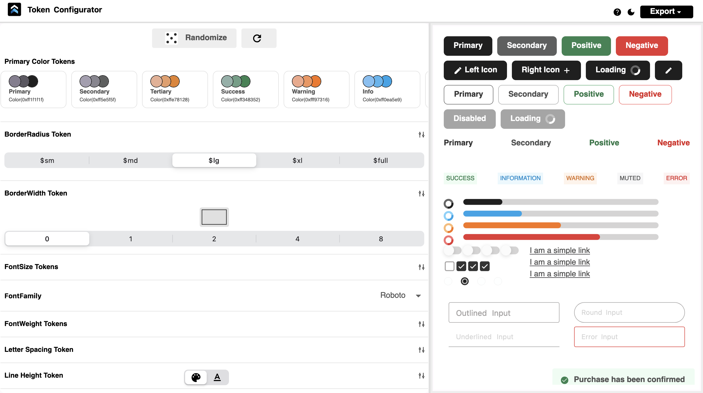

# gluestack-ui-flutter (beta)

**gluestack-ui-flutter** is a universal UI library that provides optionally styled and accessible widgets. These widgets are designed for easy integration into applications developed with Flutter.

_Package is in development. APIs may change in the future._

## Documentation


The gluestack-ui-flutter library is designed to enhance web and mobile app development. It features platform-agnostic components for consistent UI across platforms, offers styling flexibility with pre-built themes and custom options, and emphasizes accessibility. Tailored for web development, it includes web-friendly widgets, native web styling, responsive design, and smooth animations. Key considerations are Flutter web specificity, performance optimization, and community engagement. The library also enables centralized styling, consistency, reusability, scalability, efficient development, and rapid prototyping, aiming to foster collaboration and ensure a unique, high-performance UI experience.

Here are few helpful links to give you an idea of what gluestack-ui-flutter is capable of:

- Widget Examples (Storybook): https://gluestack-ui-example.web.app/#/storybook
- Getting Started Example: https://github.com/gluestack/flutter-examples
- KitchenSink (An example layout made with Gluestack): https://kitchensink-23184.web.app/
- Token Configurator: https://token-configurator.web.app/

To keep track of latest developments in gluestack-ui-flutter you can refer to this link: https://github.com/gluestack/gluestack-ui-flutter/tree/feature/core-widgets.

_We are inspired from gluestack-ui to create gluestack-ui-flutter. Please refer to the gluestack-ui-flutter documentation available at the following link for more information: https://flutter.gluestack.io/docs/overview/introduction_

## Features

- **Customizable widgets:** Each widget in the library comes with a set of customizable props that allow you to tailor its appearance and behavior to your specific needs.

- **Declarative and Dynamic Styling:** By using JSON for style configurations, you're enabling a more declarative approach to UI design. This can be particularly powerful when styles need to be changed dynamically or loaded from external sources

- **Web-focus:** While Material and Cupertino excel on mobile, gluestack-ui could be tailored for web experiences, offering components and styles optimized for desktop interaction and layout. Think responsive design, mouse hover interactions, and web-specific UI patterns.

- **Flexibility for Developers:** Providing inline style overrides gives developers the flexibility to quickly customize components on a case-by-case basis, without the need to alter the JSON configuration for minor tweaks.

- **Responsive design:** The widgets are built using modern web design principles and are fully responsive, so they work seamlessly across a wide range of devices and screen sizes.

- **Well-documented:** The package comes with comprehensive documentation for each widget, including a list of props and examples, to help you get up and running quickly.

- **Easy to use:** The widgets are designed to be easy to use and integrate into your existing Flutter applications. Simply install the library and import the widgets you need.

- **Independent from Material Design Standards:** Traditional UI frameworks like Material Design offer predefined design principles and guidelines. While beneficial, they may not always align with every application's specific aesthetic or functional requirements. By embracing independence from Material Design, developers gain the freedom to craft UI components tailored to their application's unique needs and branding. Furthermore, decoupling from Material Design can optimize performance, particularly for lightweight and fast-loading interfaces. This independence grants developers greater control over performance characteristics, potentially enhancing user experiences and reducing resource consumption.

- **Frequent updates:** We are constantly working on improving the library and adding new widgets. Follow us on GitHub to stay up-to-date on the latest releases and features.

- **Community support:** Need help using the library or have a suggestion for a new feature? Join our [Discord](https://discord.com/invite/95qQ84nf6f) channel to connect with the community and get support.

## Installation

Add the package to your dependencies:

```yaml
dependencies:
  gluestack_ui: 0.2.0-beta.2
```

OR

```yaml
dependencies:
  gluestack_ui:
    git: https://github.com/gluestack/gluestack-ui-flutter.git
```

## Usage

Wrap the `GSApp` with `GluestackProvider`.

```dart
GluestackProvider(
  child: GSApp.router(
    ....
)
```

Here's an example of how to use `GSButton` widget into your flutter app:

```dart
import 'package:gluestack_ui/gluestack_ui.dart';

GSButton(
  action: GSButtonActions.negative,
  variant: GSButtonVariants.solid,
  size: GSButtonSizes.$lg,
  onPressed: () {},
  style: GSStyle(
    web: GSStyle(
      bg: $GSColors.amber600,
    ),
    ios: GSStyle(
      bg: $GSColors.pink600,
    ),
    onHover: GSStyle(
      bg: $GSColors.green400,
    ),
    md: GSStyle(
      bg: $GSColors.pink400,
    ),
  ),
  child: const GSButtonText(text: "Click Here"),
)
```

All Gluestack widgets support dark theme. Package detects the current theme from Gluestack's inbuilt `GSTheme.of(context).brightness`. Hence, you can manage the theme mode from GSApp itself using the state management of your choice.

## Customize tokens via token config

You can customize the default tokens to provide your own design values.

```dart
GluestackProvider(
  gluestackTokenConfig: GluestackTokenConfig(
    gsColorsToken: const GSColorsToken(
      primary600: Colors.pink,
      primary700: Colors.pink,
    ),
    gsFontSizeToken: const GSFontSizeToken(
      $sm: 12,
      $md: 14,
    ),
    // More token configurations....
  ),
  child: GSApp.router(
    ....
  ),
)
```

## Providing custom Widget Config

We have build the widgets from Figma config file. In case you want to customise the default values provided by the package for individual widgets, you can specify your own configuration for the widgets.

**NOTE:** Format of the configuration must be same as the own used by Gluestack internally. For example, for button please refer to the default [config file](https://github.com/gluestack/gluestack-ui-flutter/blob/main/lib/src/theme/config/button/button.dart) for GSButton.

Below example provides custom configuration for `GSButton` widget.

```dart
// Example of button configuration.
const Map<String, dynamic> customButtonConfig = {
  ...
  '_dark': {
    'bg': '\$primary400',
    'borderColor': '\$primary700',
    ':hover': {
      'bg': '\$error300',
      'borderColor': '\$primary400',
    }
  }
  ...
};


GluestackProvider(
  gluestackCustomConfig: GluestackCustomConfig(
    button: customButtonConfig,
    buttonText: customButtonTextConfig,
    ...
  ),
  gluestackTokenConfig: GluestackTokenConfig(...),
  child: GSApp.router(
    ...
  ),
)
```

## Theming

You can add customize your app theme with help of `gsThemeToken` parameter under `GluestackProvider` inside of `gluestackTokenConfig`.
gluestack-ui for flutter comes with 2 deafult themes, light and dark, named 'light_theme' and 'dark_theme' respectively.
To modify certain specific colors of the base theme, simply create a Map like so:

```
const myTheme = {
  "light_theme": {
    "colors": {
      'primary300': Color(0xffE11D48),
      'primary400': Color(0xffE11D48),
      'primary600': Color(0xffE11D48),
      'primary700': Color(0xffE11D48),
      'success500': Color(0xffE11D48),
    }
  },
}
```

and provide this value to the `gsThemeToken`, as shown below:

```
    return GluestackProvider(
      gluestackTokenConfig: GluestackTokenConfig(
        gsThemeToken: myTheme,
      ),
      child: GSApp(
        theme: GSThemeData.fromTheme('light_theme'),
      ),
    )
```

To dyamically toggle theme application wide, you can provide theme present in the above example like so, here `currentTheme` is a state varaible, value of which can be 'light_theme' or 'dark_theme' or your custom theme name.

```
        theme: GSThemeData.fromTheme(currentTheme),
```

To create a new theme entirely, you can create the `myTheme` variable present in the above examples as shown below:

```
const myTheme = {
  "cyan_theme": {
    "colors": {
      "primary0": Color(0xFFB2EBF2),
      "primary50": Color(0xFF80DEEA),
      "primary100": Color(0xFF4DD0E1),
      "primary200": Color(0xFF26C6DA),
      "primary300": Color(0xFF00BCD4),
      "primary400": Color(0xFF00ACC1),
      "primary500": Color(0xFF0097A7),
      "primary600": Color(0xFF00838F),
      "primary700": Color(0xFF006064),
      "primary800": Color(0xFF004D40),
      "primary900": Color(0xFF00332A),
      "primary950": Color(0xFF00251A),
      "secondary0": Color(0xFFB2EBF2),
      "secondary50": Color(0xFF80DEEA),
      "secondary100": Color(0xFF4DD0E1),
      "secondary200": Color(0xFF26C6DA),
      "secondary300": Color(0xFF00BCD4),
      "secondary400": Color(0xFF00ACC1),
      "secondary500": Color(0xFF0097A7),
      "secondary600": Color(0xFF00838F),
      "secondary700": Color(0xFF006064),
      "secondary800": Color(0xFF004D40),
      "secondary900": Color(0xFF00332A),
      "secondary950": Color(0xFF00251A),
      //... Other theme colors ...
    },
  },
}
```

To check for current theme being used by the application, you can access `GSTheme.of(context).themeId`. Show below is an example of how we can conditionally use values of colors depending on current app theme.

```
  GSTheme.of(context).themeId == 'dark_theme'
          ? const Color(0xFF262626)
          : null,
```

Alternatively, you can try our very own Token Configurator tool which can help you to generate code for theming. This interactive tool not only provides a visual representation of your currently configured theme but also demonstrates how theme and token adjustments can impact your UI/UX. [Click here to see it in action!](https://token-configurator.web.app/)



## Performance

After conducting a comprehensive performance benchmark, comprising an average of 10 samples obtained from our [KitchenSink app](https://kitchensink-23184.web.app/) utilizing both gluestack-ui-flutter with Material and gluestack-ui-flutter with Non-Material widgets, we are pleased to present the ensuing results for your review.


## Future Scope

- **Enhanced Widget Configuration:** The widgets will be designed in a modular fashion, allowing users to plug in different components or features as needed. This modular approach enables more complex and varied widget compositions.With more control over the widget design, developers can create applications that offer a better user experience, tailored to their target audience.

- **Configurable Token System:** Design the token system to be scalable and customizable. Users should be able to add new tokens or modify existing ones to suit their project needs.

- **Adding New Widgets:** We are committed to implement more functional widgets in the future that would improve the user and the developer experience.

## Products

VS Code Extension: Our [VS Code extension](https://marketplace.visualstudio.com/items?itemName=gluestack.gluestack-ui-flutter) is specifically designed to quicken your development process using gluestack-ui-flutter. These extensions provide GSWidgets for effectively wrapping widgets with gluestack-ui-flutter widgets.

## Contributing

We welcome contributions from the community. If you'd like to contribute to `gluestack-ui-flutter`, please read our [contributing guide](./CONTRIBUTING.md) instructions on how to submit a pull request.

## License

Licensed under the MIT License, Copyright © 2024 GeekyAnts. See [LICENSE](./LICENSE) for more information.
