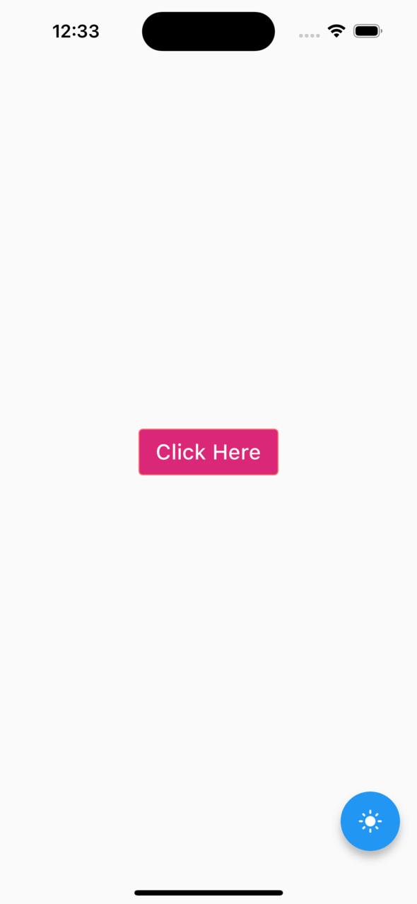
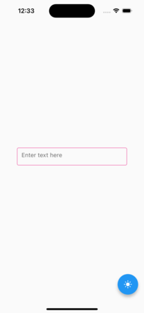
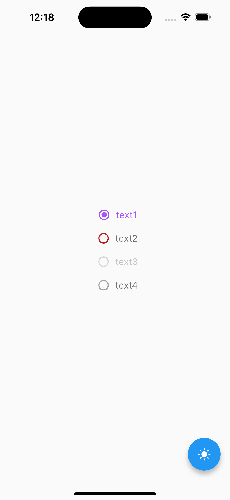

# gluestack_flutter

A new Flutter project.

## Getting Started

This project is a starting point for a Flutter application.

A few resources to get you started if this is your first Flutter project:

- [Lab: Write your first Flutter app](https://docs.flutter.dev/get-started/codelab)
- [Cookbook: Useful Flutter samples](https://docs.flutter.dev/cookbook)

For help getting started with Flutter development, view the
[online documentation](https://docs.flutter.dev/), which offers tutorials,
samples, guidance on mobile development, and a full API reference.

## Table of Contents

- File Structure
- Implementation
- Usage
- Contributing

## File Structure

The project's file structure is organized as follows:

```
├── lib/
│   ├── main.dart
│   ├── widgets/
│   │   ├── gs_box
│   │   ├── gs_button
|   |   ├── gs_input
│   ├── style/
│   │   ├── gs_style.dart
│   ├── tokens/
│   │   ├── color_token.dart
├── pubspec.yaml
├── README.md
```

## Implementation

Here is a little elaboration on how we are creating apis. For every api that we create we follow these steps where required:

#### Style

This file defines the style class, which provides a configuration mechanism for customizing the visual style of GS components. The mapping of this class allows you to configure how component should appear in different scenarios.
You can refer [here](lib/widgets/gs_button/gs_button_style.dart)

#### Provider

This file defines the GS Provider class, which is an InheritedWidget used to share the component's attributes throughout the widget tree. The updateShouldNotify method is used to determine if the widget should notify its descendants of changes in component's attributes, ensuring that updates are propagated effectively.
You can refer [here](lib/widgets/gs_button/gs_button_provider.dart)

#### GSStyle

This code defines a structured system for styling components in a Flutter application, allowing for the configuration of actions, variants, sizes, and styles for different UI elements. It appears to be part of a larger design system for consistent and maintainable styling across the application.
You can refer [here](lib/style/gs_style.dart)

## Usage

- Here is how GSButton component can be easily integrated into your Flutter app. Here's an example of how to use it:

```
import 'package:your_package/gs_button.dart';

 GSButton(
      action: GSActions.negative,
      variant: GSVariants.solid,
      size: GSSizes.lg,
      onPressed: () {},
      style: GSStyle(
          web: GSStyle(
              bg: $GSColors.amber600,
                ),
          ios: GSStyle(
              bg: $GSColors.pink600,
                ),
          onHover: GSStyle(
              bg: $GSColors.green400,
                ),
          md: GSStyle(
              bg: $GSColors.pink400,
                ),
              ),
      child: const GSButtonText(text: "Click Here"),
),
```

This code snippet demonstrates how to create a GSButton with various customization options, such as action, variant, size, and style. You can easily customize the button's appearance and behavior to match your app's design.



- Here is how GSInput component can be easily integrated into your Flutter app. Here's an example of how to use it:

```
import 'package:your_package/gs_input.dart';

  GSInput(
      size: GSSizes.xl,
      variant: GSVariants.outline,
      hintText: "Enter text here",
      style: GSStyle(
      width: 300,
      borderColor: $GSColors.pink500,
      onFocus: GSStyle(
        borderColor: $GSColors.purple800,
        borderWidth: $GSBorderWidth.$2,
        borderBottomWidth: $GSBorderWidth.$2,
      ),
      onHover: GSStyle(
        borderColor: $GSColors.green600,
        borderWidth: $GSBorderWidth.$4,
        borderBottomWidth: $GSBorderWidth.$4,
      ),
      xs: GSStyle(
        borderColor: $GSColors.purple400,
      ),
      dark: GSStyle(
        borderColor: $GSColors.warmGray900,
        borderWidth: $GSBorderWidth.$8,
      ),
    ),
),
```

This code snippet demonstrates how to create GSInput with various customization options, such as variant, size, and style. You can easily customize the input's appearance and behavior to match your app's design.


- Here is how GSRadio component can be easily integrated into your Flutter app. Here's an example of how to use it:

```
import 'package:your_package/gs_radio.dart';

  GSRadio<Value>(
      style: GSStyle(
        checked: GSStyle(
          color: $GSColors.purple500,
          onHover: GSStyle(
            color: $GSColors.pink300,
          ),
        ),
      ),
      value: Value.one,
      groupValue: groupValue,
      onChanged: (p0) {
        setState(
          () {
            groupValue = p0!;
          },
        );
      },
      icon: const GSRadioIcon<Value>(),
      label: const GSRadioText<Value>(text: 'text1'),
 ),
```

This code snippet demonstrates how to create GSRadio with various customization options. You can easily customize the radio button's appearance and behavior to match your app's design.



## Contributing

We welcome contributions from the community. If you'd like to contribute to the Gluestack Flutter Package, please follow these steps:

- Open an issue to discuss your idea or bug report.
- Fork the repository and create a new branch for your contribution.
- Implement your changes and tests.
- Create a pull request to submit your contribution.
